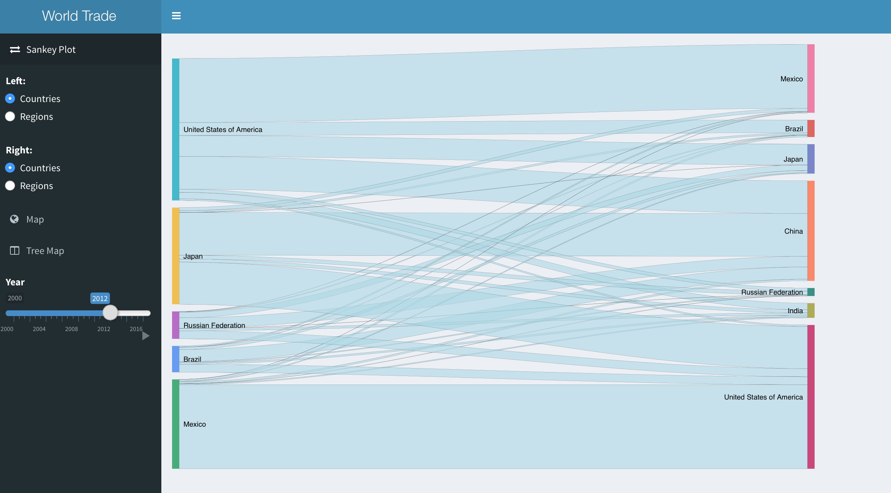
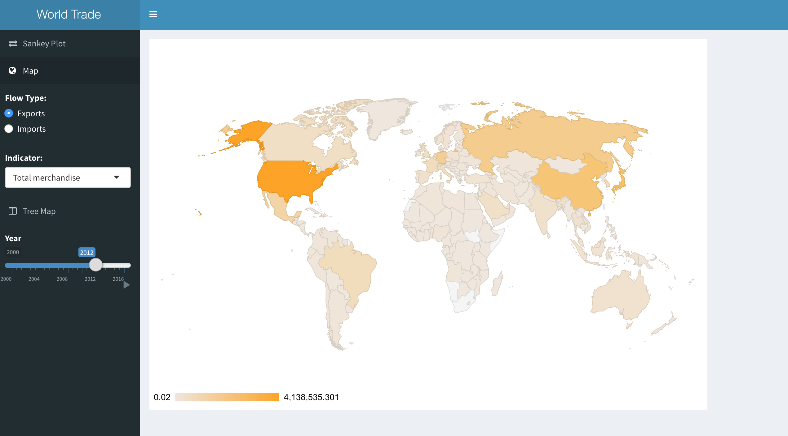
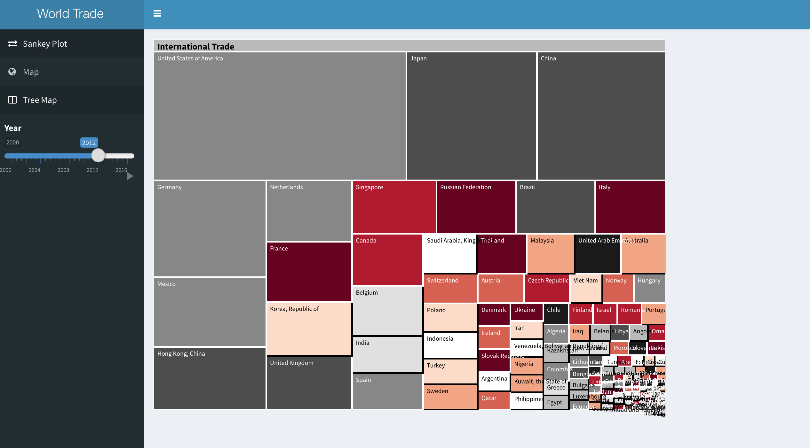
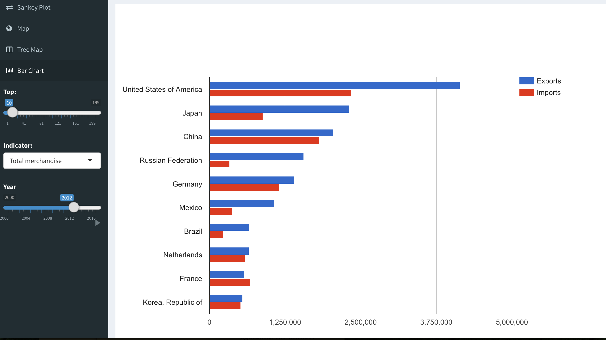

# TEAM ABC Data Visualization project

Our name means that we want to make data visualization as easy as ABC.

## Team
* Alice Zhao :panda_face:
* Valentin Vrzheshch :coffee:

Run gently in R:

_shiny::runGitHub('ABC-final', 'usfviz')_

or you can find the deployed app hosted at https://alicezhao.shinyapps.io/abc-final/

## Dataset 
The data is world trade data taken from WTO. The initial data is from 1946-2020.
However, there were a lot of missing values in the early years. Also, the speed of running the app was quite slow with too many years. 
As a result, we omitted the rows that had missing values and ended up with data starting from 2000.

## Packages
* `shiny`
* `googleVis`
* `treemap`
* `d3treeR`
* `shinydashboard`

## Interface
Our application is a 3 panel shiny dashboard. 
 

The first panel shows the sankey plot of the data. You can select whether it is country or region on both sides of the plot.
You can also see the difference as time changes. This plot only shows the total export/import value.

The second panel shows map of the data. You can select either import or export, and you can further specify the type of product or service that was traded.

The third panel is a treemap. It starts with the country, after you click, you can select import or export, the next phase would show you how much each type of product/service take up the whole import/export value.

The last panel is bar chart. You can see the country's export and import value by the categories. It shows a good comparison between the difference of export and import.

## Summary
We have learned a lot from this final project and we fell deeply in love with Shiny in the progress.
Shiny dashboard is absolutely beautiful and in our opinion much better looking than tablets.
Also deploying the app on the website is cool too!
Cheers.
🥂
